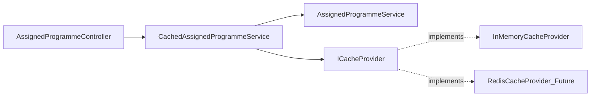

# Programme Data Caching Implementation Plan

## Architecture Overview

We'll implement a **decorator pattern** around the existing `AssignedProgrammeService` to add caching capabilities without modifying the core service logic. This approach:

- Maintains clean separation of concerns
- Allows easy switching between cached and non-cached implementations
- Supports future migration to Redis with minimal changes
- Follows the Interface Segregation Principle (ISP)



## Implementation Steps

### 1. Create Caching Abstraction Layer

**New interface:** `backend/trAInr.Application/Interfaces/ICacheProvider.cs`

- Methods: `GetAsync<T>`, `SetAsync<T>`, `RemoveAsync`, `RemoveByPrefixAsync`
- Supports both simple key-based and prefix-based cache invalidation
- Generic `<T>` support for type-safe caching
- Async operations to support future Redis integration

**Implementation:** `backend/trAInr.Infrastructure/Services/InMemoryCacheProvider.cs`

- Uses ASP.NET Core `IMemoryCache`
- Implements 30-minute sliding expiration
- Tracks cache keys by prefix for efficient bulk invalidation
- Thread-safe operations using `ConcurrentDictionary` for key tracking

### 2. Define Cache Key Strategy

Create `backend/trAInr.Application/Constants/CacheKeys.cs` with standardized key patterns:

- `programme:athlete:{athleteId}` - All programmes for an athlete
- `programme:active:{athleteId}` - Active programme for an athlete
- `programme:id:{programmeId}` - Programme by ID
- `programme:templates:premade` - All pre-made templates
- `programme:templates:created:{athleteId}` - Templates created by athlete

Prefix-based keys allow efficient cache invalidation (e.g., clear all keys with `programme:athlete:{athleteId}` prefix when athlete's data changes).

### 3. Implement Cached Service Decorator

**New class:** `backend/trAInr.Application/Services/CachedAssignedProgrammeService.cs`

This decorator wraps the original service and implements the caching logic:

**Read operations (GET):**

- Check cache first using appropriate cache key
- If cache miss, call underlying service and cache the result
- Return cached data

**Write operations (POST/PUT/DELETE):**

- Call underlying service to perform the operation
- Invalidate relevant cache entries based on the operation:
  - **Create/Update/Delete programme**: Clear athlete's programmes cache and programme-by-ID cache
  - **Activate/Deactivate**: Clear active programme cache for athlete
  - **Add/Update week**: Clear programme-by-ID cache
  - **Clone programme**: Clear target athlete's caches

**Cached methods:**

- `GetByIdAsync(Guid id)` - Cache individual programme
- `GetByAthleteIdAsync(Guid athleteId)` - Cache list of programmes per athlete
- `GetActiveByAthleteIdAsync(Guid athleteId)` - Cache active programme
- `GetPreMadeProgrammesAsync()` - Cache templates (infrequently change)
- `GetProgrammesCreatedByAthleteAsync(Guid athleteId)` - Cache created templates

### 4. Register Services in DI Container

Update `[backend/trAInr.API/Program.cs](backend/trAInr.API/Program.cs)`:

```csharp
// Add memory cache (line ~66, after DbContext registration)
builder.Services.AddMemoryCache();

// Register cache provider
builder.Services.AddScoped<ICacheProvider, InMemoryCacheProvider>();

// Register the original service
builder.Services.AddScoped<AssignedProgrammeService>();

// Register the cached decorator as the interface implementation (line ~81)
builder.Services.AddScoped<IAssignedProgrammeService>(sp =>
{
    var innerService = sp.GetRequiredService<AssignedProgrammeService>();
    var cacheProvider = sp.GetRequiredService<ICacheProvider>();
    var logger = sp.GetRequiredService<ILogger<CachedAssignedProgrammeService>>();
    return new CachedAssignedProgrammeService(innerService, cacheProvider, logger);
});
```

### 5. Cache Invalidation Strategy

**Automatic invalidation on mutations:**

| Operation | Cache Keys Invalidated |

| ---------------- | -------------------------------------------------------------------------------------------------------- |

| Create programme | `programme:athlete:{athleteId}` |

| Update programme | `programme:id:{id}`, `programme:athlete:{athleteId}`, `programme:active:{athleteId}` (if status changed) |

| Delete programme | `programme:id:{id}`, `programme:athlete:{athleteId}`, `programme:active:{athleteId}` |

| Clone programme | `programme:athlete:{targetAthleteId}` |

| Add/Update week | `programme:id:{programmeId}` |

**Template cache invalidation:**

- Templates are read-only in normal usage, so cache can expire naturally via TTL
- Future enhancement: add admin endpoints to manually clear template cache

## Future Redis Migration Path

When ready to migrate to Redis:

1. **Create** `backend/trAInr.Infrastructure/Services/RedisCacheProvider.cs` implementing `ICacheProvider`
2. **Add** `StackExchange.Redis` NuGet package
3. **Update** DI registration in `Program.cs` to use `RedisCacheProvider` instead of `InMemoryCacheProvider`
4. **Configure** Redis connection string in app settings

The rest of the code remains unchanged - this is the power of the abstraction!

## Configuration

Add to `[backend/trAInr.API/appsettings.json](backend/trAInr.API/appsettings.json)`:

```json
{
  "CacheSettings": {
    "DefaultExpirationMinutes": 30,
    "SlidingExpiration": true
  }
}
```

## Testing Approach

**Manual testing:**

1. Navigate to Programmes page → Check database queries (logs)
2. Navigate away and back → Verify no new database queries within 30 min
3. Update a programme → Navigate back → Verify fresh data loaded
4. Wait 30+ minutes → Navigate back → Verify cache expired and data reloaded

**Performance monitoring:**

- Add logging in `CachedAssignedProgrammeService` to track cache hits/misses
- Monitor database query reduction after deployment

## Files to Create/Modify

**New files:**

- `backend/trAInr.Application/Interfaces/ICacheProvider.cs`
- `backend/trAInr.Application/Constants/CacheKeys.cs`
- `backend/trAInr.Application/Services/CachedAssignedProgrammeService.cs`
- `backend/trAInr.Infrastructure/Services/InMemoryCacheProvider.cs`

**Modified files:**

- `backend/trAInr.API/Program.cs` (DI registration)
- `backend/trAInr.API/appsettings.json` (cache configuration)
- `backend/trAInr.API/appsettings.Development.json` (optional: dev-specific cache settings)
